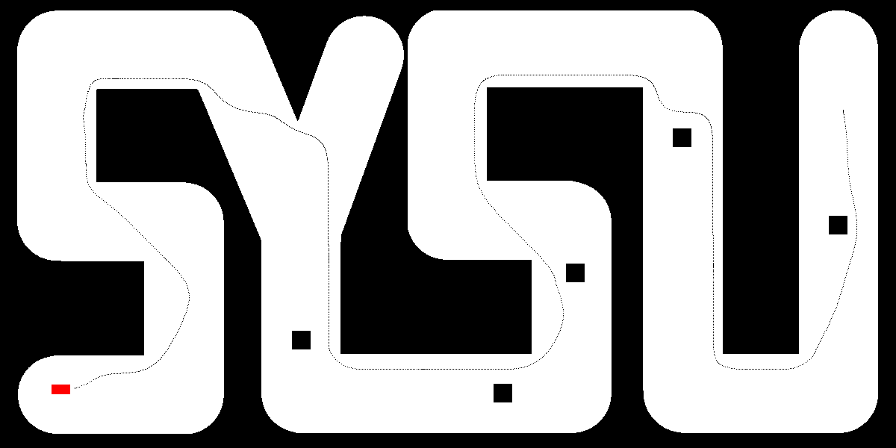

# Fundamentals-of-autopilot-project

<p align="center">
  <a href="./README_en.md">English</a> |
  <a href="./README.md">简体中文</a>
</p>


This project is a simulation of automatic pathfinding and control for a car using MATLAB and Simulink.



## Features

- **Path Planning**: Utilizes the A* algorithm to find a feasible path from the start point to the destination on a randomly generated 2D map.
- **Path Smoothing**: Implements scaling and interpolation strategies to optimize the generated path using Bezier curve interpolation and De Casteljau algorithm, achieving path smoothing and collision handling through segmented smoothing.
- **Collision-Free**: Utilizes Simulink for car path tracking simulation, establishing a controller simulation model that successfully guides the car to the destination without collisions.
- **Fast Speed**: Achieved top 3 positions (out of 35 participants) in MATLAB group competition.

## Installation

To run this project, you need to install MATLAB and the Simulink toolbox. Then clone this repository:

```bash
git clone https://github.com/LinYujupiter/Fundamentals-of-autopilot-project.git
cd Fundamentals-of-autopilot-project
```

## Running

Focus on the "仿真模型" (Simulation Model) folder, which contains the main contribution and execution files of this project.

```bash
cd ./仿真模型
```

The functionality of each file in the "仿真模型" (Simulation Model) folder is as follows:

- car_sim_for_student_r2015.slx is the Simulink simulation model file.
- Generate_Miniature_Path.m generates a path using the A* algorithm based on map information, expanding the map by 20 pixels, scaling it down by 0.2 times, and then generating the path. The input of this .m file is different sysu_standard.mat files, and the output is path.mat, which includes the x and y coordinates of the path on the shrunken map.
- Smooth_Path.m takes the shrunken path, enlarges it, smooths it multiple times, filters it by curvature, and converts it into a format suitable for vehicle travel. Then it transforms the coordinates of this path, adds phi and curvature information, and outputs it in the same format as the sample file traj_diySYSU.mat.
- lqr_nums.m is the file loaded by initfcn before Simulink simulation. It loads map and path information into the workspace and calculates the result k of the LQR controller.
- make_GIF.m parses the saved simout.mat file after simulation and reproduces the car's driving process using functions, finally selecting about 200 frames to create a GIF image. The second value in the GIF naming indicates the duration of the simulation (in seconds).
- These files all have a pathnums variable, which is for convenient naming, representing the data of which map. For example, if pathnums='3' in lqr_nums.m, it will simulate on the third map.

Instructions for running: Set the MATLAB working folder to the Simulation Model folder. First, name the map sysu_standard.mat and place it in the map and path directory. Then modify pathnums in all .m files to the named numerical identifier. Next, run Generate_Miniature_Path.m, which will produce results after approximately 11000 iterations. Then run Smooth_Path.m, followed by running Simulink. After Simulink completes running, run make_GIF.m to output a complete GIF image.

## Development

- **MATLAB**: Used as the base language for the project.
- **Simulink**: Used for simulating car movement.
- **LQR Controller**: Used for lateral control of the car.
- **PID Controller**: Used for longitudinal control of the car.

## Contribution

We welcome contributions in any form, whether it's proposing new features, improving code, or reporting issues. Please make sure to follow best practices and code style guidelines.